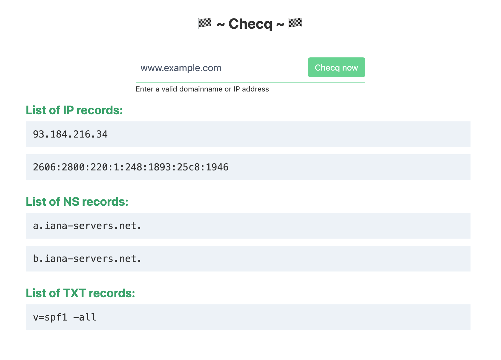

<h1 align="center">Welcome to Checq 👋</h1>
<p>
  
  <a href="https://travis-ci.com/EdinTC/Checq">
    
  </a>
  <a href="https://github.com/EdinTC/Checq/blob/master/LICENSE">
    
  </a>
</p>

> This API retrieves the IP and DNS information for the given Domain/IP. Written in Golang and Svelte



Visit the website at [checq.intercube.io](https://checq.intercube.io).<br />
Or download the Google Chrome extension from the [Chrome Web Store](https://chrome.google.com/webstore/detail/checq/giaodihedambnlglofagflcddonafbje).

## Installation & Usage

```sh
docker-compose up -d
```

## Authors

👤 **EdinTC & Jensderond**

* Github: [@EdinTC](https://github.com/EdinTC)
* Github: [@Jensderond](https://github.com/Jensderond)

## 🤝 Contributing

Contributions, issues and feature requests are welcome!<br />Feel free to check the [issues page](https://github.com/EdinTC/Checq/issues).

## Show your support

Give a ⭐️ if this project helped you!

## 📝 License

Copyright © 2020 [EdinTC](https://github.com/EdinTC) & [Jensderond](https://github.com/Jensderond).<br />
This project is [GPL-3.0](https://github.com/EdinTC/Checq/blob/master/LICENSE) licensed.
